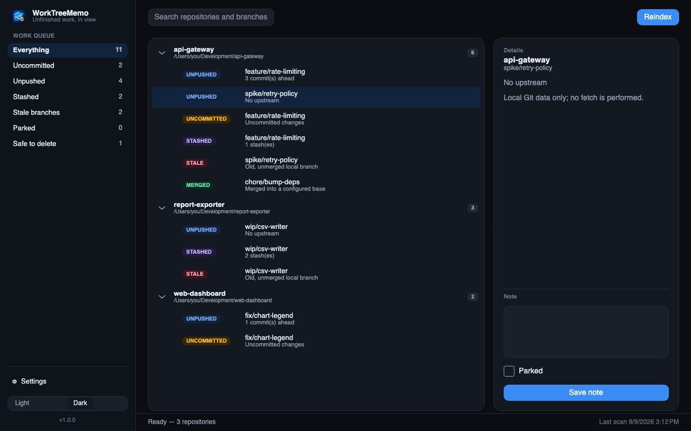
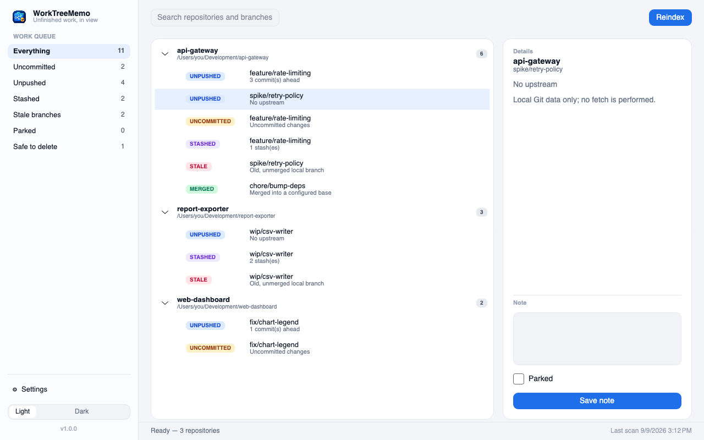
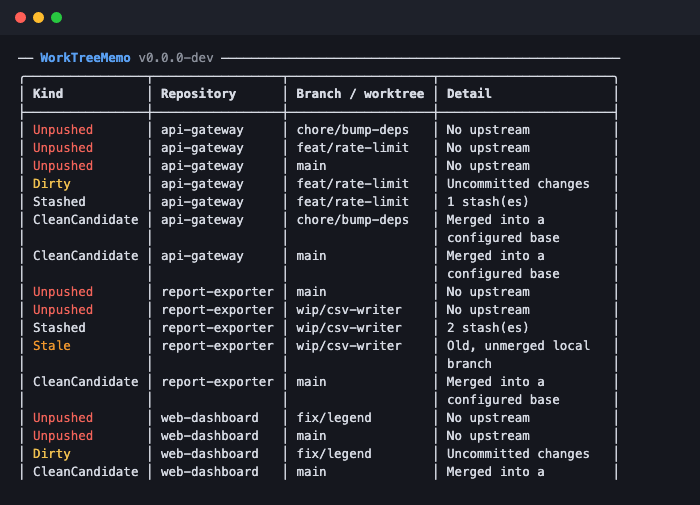

<p align="center">
  
</p>

# WorkTreeMemo

WorkTreeMemo is a lightweight .NET 10 desktop and command-line app for keeping unfinished work in local Git repositories visible. It runs quietly in the system tray, opens a modern desktop workspace when needed, and provides the same core actions from the terminal.

## Preview

<p align="center">
  
</p>

The desktop workspace groups unfinished work by repository, filters it by type, and lets you save a note for each branch-based item. It supports light and dark appearances.

<p align="center">
  
</p>

The same status view is available in the terminal:

<p align="center">
  
</p>

## Highlights

- Discover Git repositories under folders you choose.
- Identify repositories with uncommitted changes, unpushed commits, and recent activity.
- Run continuously from the system tray or start a focused scan on demand.
- Manage scan roots and intervals from both the GUI and the CLI.
- Use a modern, colour-aware terminal interface.
- Follow your system's light or dark appearance, and override it whenever you like.
- Receive a startup notification when a newer GitHub Release is available.
- Get a clear warning in both interfaces when Git is not installed or is unavailable on `PATH`.

## Install

Download the archive for your platform from the [GitHub Releases](https://github.com/MCKanpolat/WorkTreeMemo/releases) page:

- `WorkTreeMemo-<version>-win-x64.zip` for 64-bit Windows
- `WorkTreeMemo-<version>-osx-arm64.zip` for Apple Silicon Macs
- `WorkTreeMemo-<version>-osx-x64.zip` for Intel Macs

On Windows, extract the archive and run `WorkTreeMemo`. On macOS, extract the archive and move `WorkTreeMemo.app` to `Applications` before opening it; the app bundle carries the Dock icon. To use the command-line executable from any terminal, add the extracted Windows directory to your `PATH`.

## Desktop app

Run the executable with no arguments to start the desktop app. WorkTreeMemo remains available from the system tray; click its icon to open the workspace. The app scans configured roots while it is running, and **Reindex** discovers repositories again immediately.

The sidebar is the work queue: pick a category to filter the list, which is grouped by repository. Selecting an item opens its details on the right, where branch-based items can also carry a note.

**Appearance.** On its first launch WorkTreeMemo reads the light or dark setting from your operating system and records the result in `config.json`. From then on that file decides, so the app keeps the appearance you chose even if the system changes. Switch it at any time from the sidebar or from **Settings**, and the choice is written straight back to the configuration.

Scan roots live under **Settings**. Configuration is stored locally in the operating system's application-data directory at `WorkTreeMemo/config.json`:

```json
{
  "Culture": "en-US",
  "Theme": "Dark"
}
```

## Command line

The same executable provides the CLI whenever an action argument is supplied.

```bash
# Open the desktop app
WorkTreeMemo

# Show tracked repository status in the terminal
WorkTreeMemo status

# Scan existing repositories, or rediscover them from every configured root
WorkTreeMemo scan
WorkTreeMemo reindex

# Manage scan roots
WorkTreeMemo config roots
WorkTreeMemo config add-root ~/Development 3
WorkTreeMemo config remove-root ~/Development

# Print the installed application version
WorkTreeMemo --version
```

During local development, use the same commands through `dotnet run`:

```bash
dotnet run --project src/WorkTreeMemo.App -- status
```

## Build from source

WorkTreeMemo uses the .NET SDK version pinned in `global.json`, Central Package Management, and a `.slnx` solution file.

```bash
dotnet restore WorkTreeMemo.slnx
dotnet build WorkTreeMemo.slnx --configuration Release
dotnet test tests/WorkTreeMemo.Core.Tests/WorkTreeMemo.Core.Tests.csproj --configuration Release
```

## Releases and versioning

Every push to `main` runs the release workflow. It calculates the semantic version with [MCKanpolat/auto-semver-action](https://github.com/MCKanpolat/auto-semver-action) pinned to `1.0.12`, builds self-contained Windows and macOS binaries, and creates a GitHub Release.

Use `#major`, `#minor`, or `#patch` in a commit message to select the version bump. When no marker is present, the workflow uses a patch release. GitHub automatically generates the release notes shown as **What's New**.

The calculated release version is embedded in the application and displayed in both the desktop UI and CLI.
