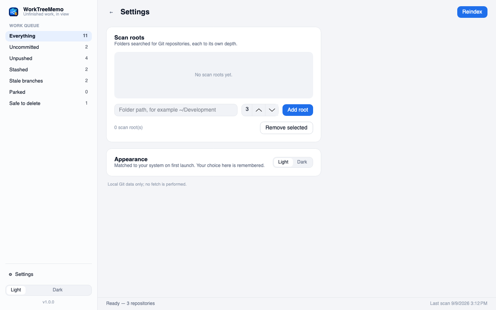

test <p align="center">
  
</p>

# WorkTreeMemo

WorkTreeMemo is a lightweight .NET 10 desktop and command-line app for keeping unfinished work in local Git repositories visible. It runs quietly in the system tray, opens a modern desktop workspace when needed, and provides the same core actions from the terminal.

## Preview

All screenshots below use fictional repositories and sample data.

<p align="center">
  
</p>

The desktop workspace groups unfinished work by repository, shows the most recent commit, working-tree, and stash timestamps, and offers one-click favourites, flags, filters, and expand/collapse controls.

<p align="center">
  
</p>

Saved views, scan-root settings, and appearance controls stay local to the machine:

<p align="center">
  
</p>

The same status and report export capabilities are available in the terminal:

<p align="center">
  
</p>

## Highlights

- Discover Git repositories under folders you choose.
- Identify repositories with uncommitted changes, unpushed commits, stashes, merged branches, and stale branches.
- Persist a local scan snapshot so reopening the app does not automatically rescan a fresh workspace.
- Favourite repositories or flag individual branch items, then use the sidebar to focus the queue.
- See the latest commit, disk-change, and stash dates alongside each item.
- Record notes, a next step, a local reference, and an optional snooze date for branch work.
- Save and recall a named combination of search and filters.
- Review recent scan changes, classification evidence, and scan-health warnings in the inspector.
- Export the current classified queue as JSON or Markdown.
- Run continuously from the system tray or start a focused scan on demand.
- Manage scan roots and intervals from both the GUI and the CLI.
- Use a modern, colour-aware terminal interface.
- Follow your system's light or dark appearance, and override it whenever you like.
- Receive a startup notification when a newer GitHub Release is available.
- Get a clear warning in both interfaces when Git is not installed or is unavailable on `PATH`.

## Install

Download the archive for your platform from the [GitHub Releases](https://github.com/MCKanpolat/WorkTreeMemo/releases) page:

- `WorkTreeMemo-<version>-win-x64.zip` for 64-bit Windows
- `WorkTreeMemo-<version>-osx-arm64.zip` for Apple Silicon Macs
- `WorkTreeMemo-<version>-osx-x64.zip` for Intel Macs

On Windows, extract the archive and run `WorkTreeMemo`. On macOS, extract the archive and move `WorkTreeMemo.app` to `Applications` before opening it; the app bundle carries the Dock icon. To use the command-line executable from any terminal, add the extracted Windows directory to your `PATH`.

## Desktop app

Run the executable with no arguments to start the desktop app. WorkTreeMemo remains available from the system tray; click its icon to open the workspace. The app reopens its saved local snapshot immediately, then scans only when that snapshot has passed the configured interval. **Reindex** always rediscovers repositories immediately.

The sidebar is the work queue: pick a category to filter the list, including **My favourites** and **Flagged**. Search, sort, and the **Collapse all** / **Expand all** controls operate on the repository groups. The favourites count is a repository count, so one favourite repository with several rows still counts as one.

Select an item to open its details on the right. Every item shows the evidence behind its classification; branch items can also carry a note, next step, local reference, flag, and snooze date. Stash rows display the most recent stash timestamp. The inspector also summarizes recent changes since the previous scan and any repositories that could not be read.

Use **Settings** to save a named view. A saved view remembers the current search text, category, favourites filter, and flagged filter. It does not copy repository data or contact a remote service.

**Appearance.** On its first launch WorkTreeMemo reads the light or dark setting from your operating system and records the result in `config.json`. From then on that file decides, so the app keeps the appearance you chose even if the system changes. Switch it at any time from the sidebar or from **Settings**, and the choice is written straight back to the configuration.

Scan roots live under **Settings**. Configuration is stored locally in the operating system's application-data directory at `WorkTreeMemo/config.json`:

```json
{
  "Culture": "en-US",
  "Theme": "Dark"
}
```

## Command line

The same executable provides the CLI whenever an action argument is supplied.

```bash
# Open the desktop app
WorkTreeMemo

# Show tracked repository status in the terminal
WorkTreeMemo status

# Scan existing repositories, or rediscover them from every configured root
WorkTreeMemo scan
WorkTreeMemo reindex

# Write the current classified work queue to a local report
WorkTreeMemo export-json ~/Desktop/worktreememo-report.json
WorkTreeMemo export-markdown ~/Desktop/worktreememo-report.md

# Manage scan roots
WorkTreeMemo config roots
WorkTreeMemo config add-root ~/Development 3
WorkTreeMemo config remove-root ~/Development

# Print the installed application version
WorkTreeMemo --version
```

During local development, use the same commands through `dotnet run`:

```bash
dotnet run --project src/WorkTreeMemo.App -- status
```

## Build from source

WorkTreeMemo uses the .NET SDK version pinned in `global.json`, Central Package Management, and a `.slnx` solution file.

```bash
dotnet restore WorkTreeMemo.slnx
dotnet build WorkTreeMemo.slnx --configuration Release
dotnet test tests/WorkTreeMemo.Core.Tests/WorkTreeMemo.Core.Tests.csproj --configuration Release
```

## Releases and versioning

Every push to `main` runs the release workflow. It calculates the semantic version with [MCKanpolat/auto-semver-action](https://github.com/MCKanpolat/auto-semver-action) pinned to `1.0.12`, builds self-contained Windows and macOS binaries, and creates a GitHub Release.

Use `#major`, `#minor`, or `#patch` in a commit message to select the version bump. When no marker is present, the workflow uses a patch release. GitHub automatically generates the release notes shown as **What's New**.

The calculated release version is embedded in the application and displayed in both the desktop UI and CLI.

## License

WorkTreeMemo is available under the [MIT License](LICENSE).
